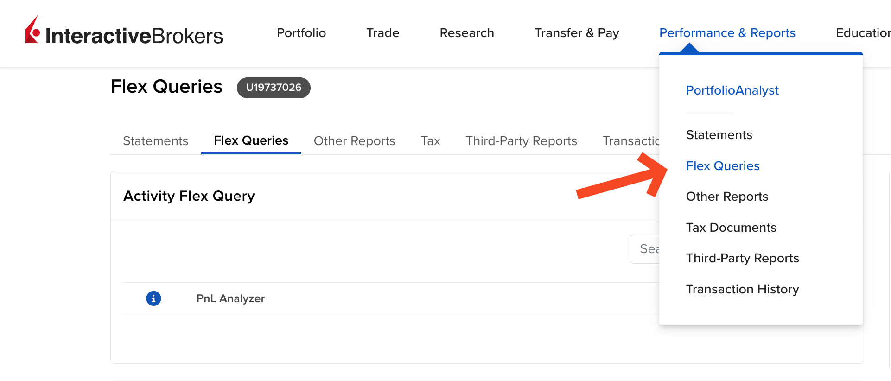
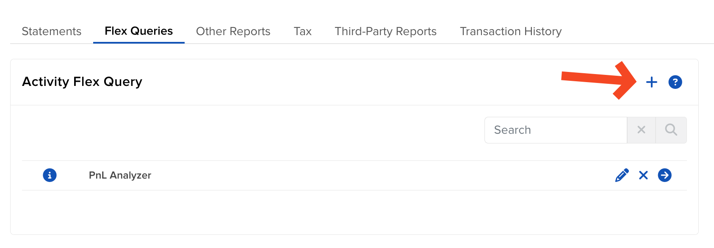
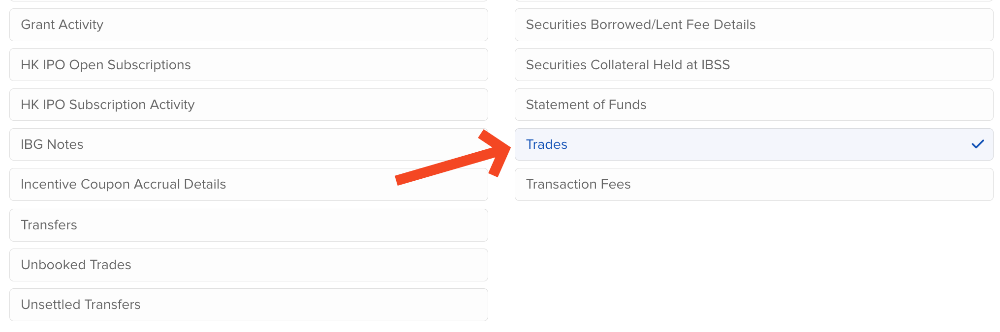
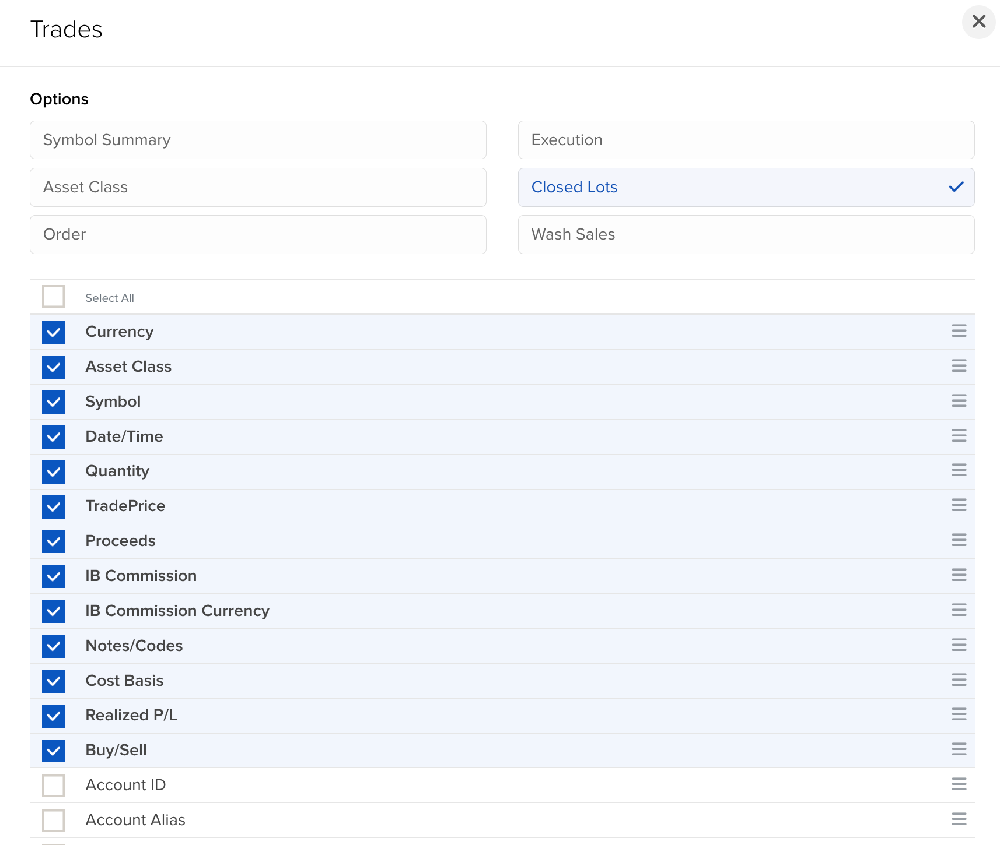
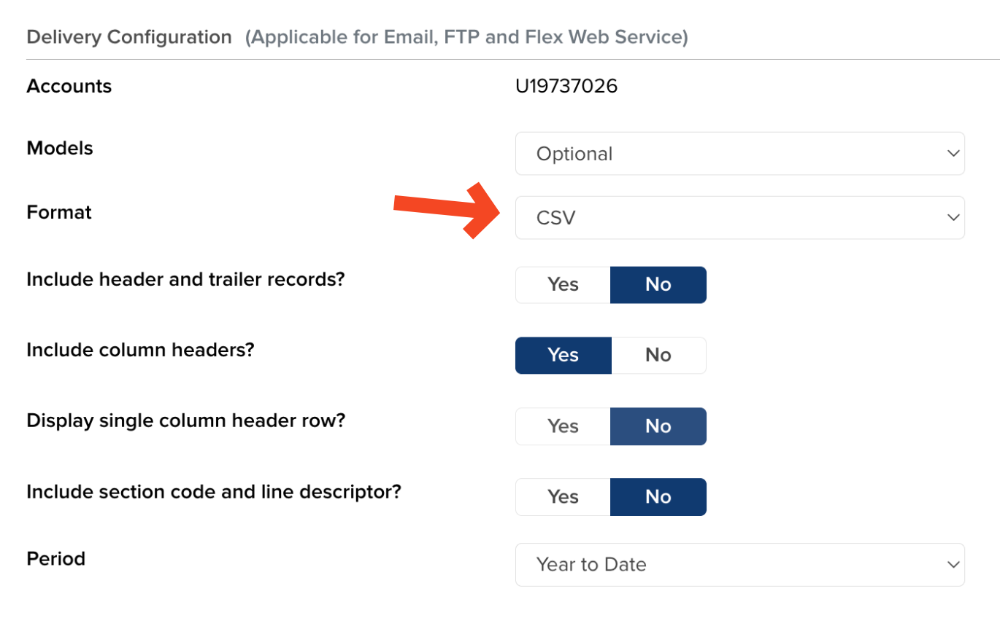
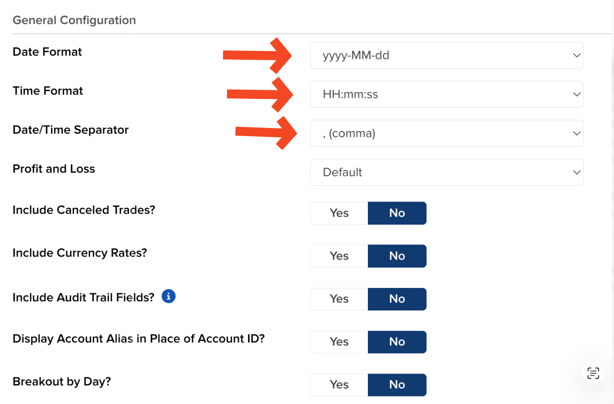
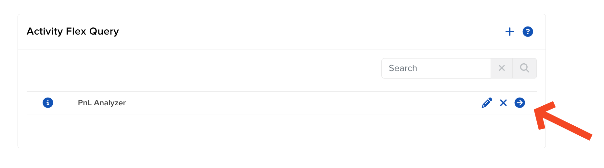

## IBKR PnL Visualizer 🚀

Visualize your Interactive Brokers realized PnL from a Flex CSV. Zero backend, all in your browser.

### Quick start

- Open `index.html` (from a built package) or run with Vite (npm run dev/build)
- First load shows demo data so you can poke around immediately
- Click "Upload CSV" to visualize your own IBKR Flex CSV

### Live demo

- Deployed on Railway: [ibkr-visualizer.up.railway.app](https://ibkr-visualizer.up.railway.app/)

### Features ✨

- Smooth cumulative Realized PnL chart with hover tooltips
- Time ranges: 24h, 1w, 1m, all (auto weekly bucketing for long spans)
- Completed Trades view that groups fills within ~15 min sessions
- Orders view for raw fills (chronological)
- Client‑side only: your CSV stays in the browser

> Side effect: spreadsheet‑related stress drops by 97%.*
>
> _*n=1, caffeinated developer study._

### How do I get my CSV? (Flex Query) 📤

Important: Use "Closed Lots" (or include the Realized P/L fields). This guarantees correct realized PnL.

1) Open the IBKR Client Portal and go to Performance & Reports → Flex Queries



2) Create a new Activity Flex Query (the plus button)



3) In Sections, choose Trades



4) Under Options, set Execution to Closed Lots and select these columns:
   - Date/Time (DateTime)
   - Symbol
   - Asset Class
   - Currency
   - Quantity
   - Proceeds
   - IB Commission
   - Cost Basis
   - Realized P/L (or FifoPnlRealized)
   - Buy/Sell



5) In Delivery Configuration, choose CSV and keep column headers enabled



6) At the bottom, set the Date/Time format so the app can parse your CSV correctly:
   - Date Format: `yyyy-MM-dd`
   - Time Format: `HH:mm:ss`
   - Date/Time Separator: `, (comma)`



7) Save the query and run it (arrow button) → download the CSV → click "Upload CSV" in the app



### Notes

- ESLint enforces no semicolons per project style
- Demo data is generated on-the-fly for a pleasant first impression
- Privacy: All processing happens locally in your browser. Files are never uploaded to a server.

### Run locally (with Vite) 🧑‍💻

This is a React + Vite app. Opening `index.html` from the file system won’t work (blank page) because the modules are served by the dev server. Use Vite:

1) Requirements: Node 18+ and npm
2) Install deps

```bash
npm ci
```

3) Start dev server

```bash
npm run dev
```

Open the printed URL (default `http://localhost:5174`).

4) Build static files (for hosting on any static host)

```bash
npm run build
npm run preview # optional local preview
```

### Deploying 🚢

- Static hosting (recommended): Deploy the `dist/` folder to any static host (GitHub Pages, Cloudflare Pages, Netlify, Vercel static, NGINX). No backend required.
- Railway: either use a Static Site (publish dir `dist`) or a Node service with `npm run preview -- --host 0.0.0.0 --port $PORT`.

### CSV export reminder

- Use Flex Query → Activity Flex Query → choose **Closed Lots** (recommended).
- Include: DateTime, Symbol, Currency, Quantity, Proceeds, Commission, Cost Basis, Realized P/L, Buy/Sell.
- Output: CSV → Run → download → Upload in the app.

### Open source

The app is open source — contributions welcome! → [`smyth64/ibkr-pnl-visualizer`](https://github.com/smyth64/ibkr-pnl-visualizer)

### Prebuilt download (zip) 📦

Yes — we can provide a ready‑to‑run zip so folks can double‑click `index.html` without Node/Vite:

1) Build once:

```bash
npm run build
```

2) Zip the `dist` folder and attach it to a GitHub Release (Releases → Draft new release → Upload `dist.zip`).

3) Users download the zip, unzip, and open `dist/index.html` — it works offline.

Tip: Add a “Assets: dist.zip” link in the README so it’s easy to find.

